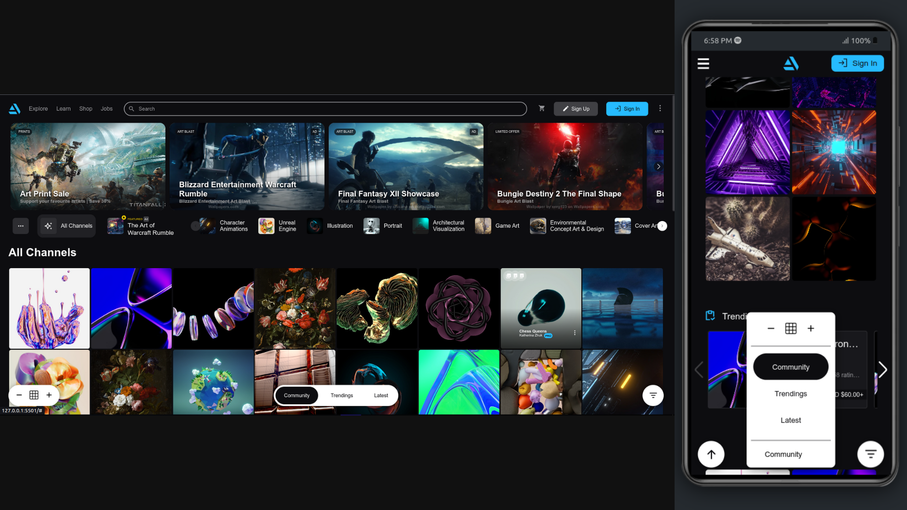

## Artstation-clone

## Preview

## Overview

This project is my Artstation-clone page, which is created to challenge my frondend-development skills, and handling complex layouts, UI-widgets, Responsiveness,... . I used just pure HTML/Sass/JS to implement all of its features (dropdowns, scrollers/sliders, grid-layouts, responsiveness, ...). additional pages may be added in the future!

## Technologies used

languages
HTML5: To structure a semantic & accessible markup
Sass / CSS: To style the page
Javascript: to handle functionalities/UI-manipulations

tools
Gulp: To compile Sass files

## features

- Fully Responsive on any device (mobile, desktop, ...)

- Using Sass power to create a robust, modular, clean and powerful stylesheet for the page (which can be extended/reused in the future)

- modular & component(utility) based Sass/CSS to style the page, and reusable styling rules, some of Sass/CSS-components:
   + icon
   + badge
   + button
   + dropdown
   + divider

- hover-dropdowns: Just like Artstation, when user hovers over top-navar dropdown-links, the menu opens/closes (with a focus-underline below them)

- Mobile menu: on mobile devices we have a special menu (which opens by tapping on hamburger-icon), which works fine, like Artstation-menu

- search input's quick results: when user focuses on search input, its quick-results is shown below the input

- gallery-scrollers: to implement the snappy-scrollers of Artstation, I used just pure HTML/CSS/JS, without using any library to challenge my base knowledge, so those scrollers(or carousels) are implemented:
  - in desktop: snapping is implemented by Javascript skills
  - in mobiles(recognized by a script): snapping is implemented by CSS-scroll-snap rules (it works just fine by touch screens)

- sticky channels-section: in desktop sizes, just like Artstation landing-page, we have a sticky channels section with all of its content, carousel-sliders, menus, ...

- artworks-grids: implemented by CSS-Grid, and controlled by JS (user can decrease/increase the size of cells by minus/plus buttons in the bottom navbar)

- Dynamic artworks-grid sizes: user can change size of artworks-grid items by minus/plus button

- artworks-grids posts: each post has a nice CSS-transition to smoothly show the artwrok info(artist, category, ...) when user just hovers on the artwork(post) in the grid (exactly like Artstation)

- Trending posts section: also we have a responsive trendings section which is a carousel-slider, and snaps on mouse-drag, touch-drag,.. (JS + CSS)